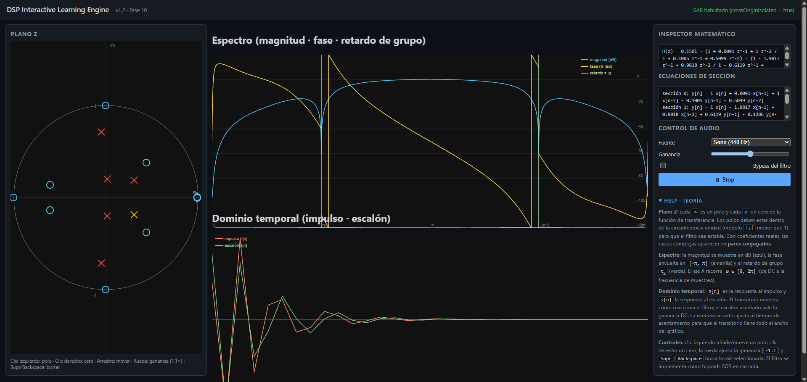

# 🎛️ DSP Interactive Lab

[](https://manwell47.github.io/DSP-Interactive-Lab/)


**Motor interactivo de aprendizaje de procesamiento digital de señales (DSP).**
Edita polos y ceros en el plano Z y escucha, en tiempo real, el resultado: espectro
(magnitud en dB, fase y retardo de grupo), respuesta al impulso y al escalón, y audio
en vivo. Construido con TypeScript + Vite sobre la Web Audio API.

---

## 📸 Captura



---

## ✨ Características

- **Plano Z editable** — arrastra polos (✕) y ceros (○); los pares conjugados se mantienen
  automáticamente. Rueda del ratón para ajustar la ganancia, teclas `Supr` / `Retroceso`
  para borrar la raíz seleccionada.
- **Espectro en tiempo real** — magnitud en dB, fase (envuelta y desarrollada) y retardo de
  grupo τ_g, con rejilla de frecuencia (0 … 2π) y de nivel (−120 … +20 dB).
- **Dominio temporal** — respuesta al impulso y al escalón con **ventana adaptativa**: el
  transitorio se muestra a lo ancho del gráfico con eje en cero y leyenda.
- **Audio en vivo** — reproducción vía `AudioWorkletProcessor` con fuentes de ruido blanco y
  senoidal, control de ganancia y *bypass* con *crossfade* sin clics.
- **Inspector matemático** — función de transferencia H(z) por secciones y recursión de cada
  biquad actualizadas al instante.
- **Sección HELP** integrada con la teoría de plano Z, espectro y dominio temporal.

## 🏗️ Arquitectura: tres hilos

| Hilo | Rol | Detalle |
|------|-----|---------|
| **A · Main** | Interfaz | No ejecuta DSP; dibuja Canvas y orquesta. |
| **B · `DspWorker`** | Cómputo DSP | Escribe el espectro en un `SharedArrayBuffer` (SAB) + `Atomics` y publica los coeficientes SOS. |
| **C · `IirSosProcessor`** | Audio | `AudioWorkletProcessor` que aplica el filtro con rampas de parámetros sin clics. |

El render se sincroniza por **versión atómica** (SAB): el bucle `requestAnimationFrame` solo
redibuja cuando la versión cambia, evitando trabajo ocioso.

> ⚠️ **Requisito de seguridad**: la app usa `SharedArrayBuffer`, por lo que necesita
> `crossOriginIsolated === true`. El `vite.config.ts` ya incluye las cabeceras
> `Cross-Origin-Opener-Policy` / `Cross-Origin-Embedder-Policy` para el dev server y el build.

## 🚀 Puesta en marcha

```bash
npm install
npm run dev      # dev server en http://localhost:5173
npm run build    # build de producción en dist/
npm run preview  # sirve el build (con cabeceras COOP/COEP)
```

### Calidad

```bash
npm test              # 84 tests unitarios (Vitest)
npm run typecheck     # tsc --noEmit (núcleo)
npm run typecheck:web # tsc -p tsconfig.browser.json (navegador)
```

## 🖱️ Controles

| Acción | Resultado |
|--------|-----------|
| **Clic** en el plano Z | Crea un polo (✕) en esa posición |
| **Clic derecho** | Crea un cero (○) |
| **Arrastrar** una raíz | La mueve (manteniendo su conjugado) |
| **Rueda del ratón** | Sube/baja la ganancia (paso 1.1×) |
| **`Supr` / `Retroceso`** | Elimina la raíz seleccionada |
| Botón **Play** | Reproduce el audio procesado en vivo |

## 🧰 Stack

- **TypeScript 5.6** · **Vite 5.4** · **Vitest 2.1**
- **Web Audio API** — `AudioWorkletProcessor`, `AudioContext`
- **Web Workers** + `SharedArrayBuffer` + `Atomics` (sincronización lock-free)
- **Canvas 2D** para las tres vistas (plano Z, espectro, dominio temporal)

## 📁 Estructura

```
src/
├── core/     # Motor DSP: síntesis SOS, espectro, retardo de grupo, unwrap,
│             # worker, procesador de audio, layout/interacción del plano Z
├── ui/       # Vistas Canvas, inspector, captura de entrada, orquestación DspApp
└── tests/    # 84 tests unitarios (fases 1–9)
```

## 📄 Licencia

[MIT](https://opensource.org/licenses/MIT) — úsalo, estúdialo y modifícalo libremente.
