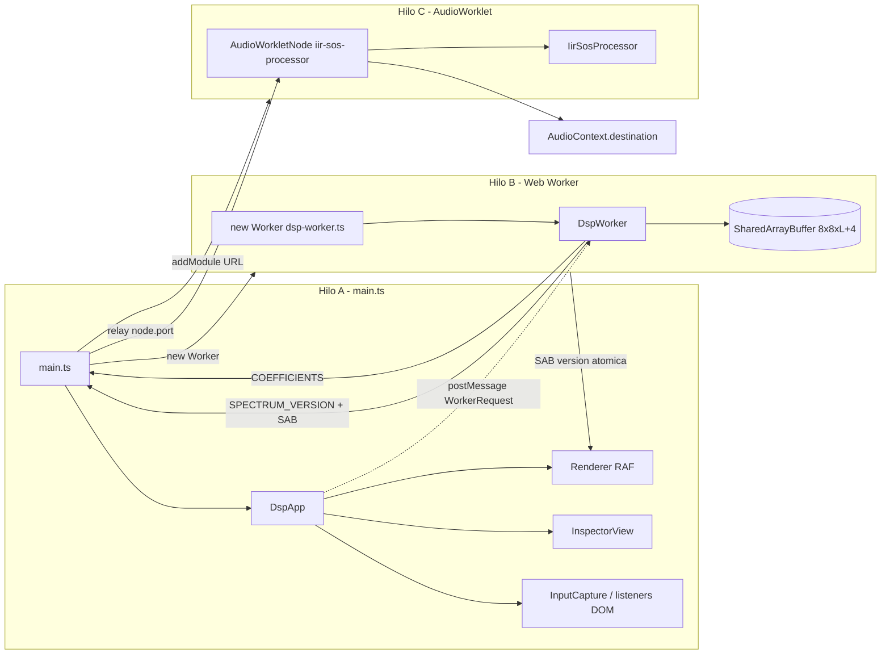

# Fase 10 — Integración y despliegue en navegador

## Contexto

Los núcleos port-like de las Fases 5–9 están completos y verdes (84/84 tests). Todos los
hilos están implementados como clases inyectables y testables en Node, pero **no existe
ninguna entrada de navegador**: no hay `index.html`, no hay `main.ts`, no hay bundler
(`package.json` solo tiene scripts de test), no hay `new Worker(...)`, no hay
`audioWorklet.addModule(...)`, y el bucle RAF de [`app.ts`](../src/ui/app.ts:90) observa un
`Int32Array` de respaldo en vez del SAB real.

Vite 5.4.21 ya está en `node_modules` (dependencia transitiva de Vitest).

## Objetivo

Construir la capa de ejecución real de los tres hilos y servirla con Vite + cabeceras
COOP/COEP para habilitar el camino SharedArrayBuffer (§9.1, §9.3, §12 de ARCHITECTURE.md).



## Archivos nuevos

### 1. `index.html` (raíz, entrada de Vite)

- `<script type="module" src="/src/main.ts">`.
- Canvases: `#zplane` (plano Z), `#spectrum`, `#time`.
- Panel inspector: `#inspector-transfer` (H(z)), `#inspector-equation` (recursión).
- Controles de audio: `<select>` fuente (`white-noise|sine|user-sample|none`),
  slider ganancia, checkbox bypass, botón play/stop.
- Barra de estado `#status`: muestra `crossOriginIsolated` (SAB habilitado o fallback).
- CSS mínimo (layout en columnas/flex); los colores de dibujo ya los fija cada vista.

### 2. `src/main.ts` (bootstrap del navegador)

Orden de arranque:

1. `const isolated = crossOriginIsolated === true;` → render en `#status`.
2. `const audio = new AudioContext({ latencyHint: 'interactive' })`.
3. `await audio.audioWorklet.addModule(new URL('./core/iir-sos-processor.ts', import.meta.url))`.
   Vite emite el worklet como módulo con sus imports resueltos.
4. `const node = new AudioWorkletNode(audio, 'iir-sos-processor')` → `node.connect(audio.destination)`.
5. `const worker = new Worker(new URL('./core/dsp-worker.ts', import.meta.url), { type: 'module' })`.
   `DspWorker` ya se auto-enlaza a `globalThis.onmessage/postMessage` dentro del worker.
6. Contextos de canvas: `document.querySelector<HTMLCanvasElement>('#zplane').getContext('2d')`
   (idem `#spectrum`, `#time`). Pasar el canvas del plano Z como `zCtx`, etc.
7. Wrapper `workerPort` (permite que `main.ts` observe los mensajes sin romper `DspApp`):

   ```ts
   const workerPort: WorkerLike = { postMessage: (m) => worker.postMessage(m), onmessage: null };
   worker.onmessage = (e) => {
       workerPort.onmessage?.(e);   // manejador interno de DspApp (SPECTRUM_VERSION → SAB)
       onWorkerMessageForPanel(e.data); // panel inspector / status
   };
   ```

8. Construir `DspAppPorts`:
   - `workerPort`, `nodePort: node.port` (mínimo `postMessage(AudioNodeMessage)`),
   - `schedule: (cb) => requestAnimationFrame(cb)`,
   - `zCtx / spectrumCtx / timeCtx` (CanvasRenderingContext2D → satisfacen `ZPlaneDraw`),
   - `width / height` desde `canvas.clientWidth / clientHeight`, `margin: 8`.
9. `const app = new DspApp(ports); app.start();`
10. Listeners DOM → métodos públicos de `app` (equivalente a lo testeado en
    `phase9_ui.test.ts` T-APP-*), restando el `origin` del canvas vía
    `getBoundingClientRect()`:
    - `pointerdown` → `app.onPointerDown(x, y, e.button)` (+ `preventDefault` para el clic derecho),
    - `pointermove` → `app.onPointerMove(x, y)`, `pointerup` → `app.onPointerUp()`,
    - `wheel` → `app.onWheel(e.deltaY)`,
    - `keydown` Delete/Backspace → `app.deleteSelected()`.
    - `InputCapture` queda como clase de referencia/test; el wiring real llama a `DspApp`
      directamente (que ya hace `forward()` + `draw()`).
11. Controles de audio → `app.setSource / setGain / setBypass / setPlaying`.
12. `window.resize` → recalcular tamaños de canvas → `app.resize(w, h)`.
13. `onWorkerMessageForPanel`: al recibir `COEFFICIENTS`, renderizar en el DOM
    `InspectorView.formatTransfer(sos)` y `InspectorView.formatEquation(sos)`.
14. Handshake inicial (para pintar el primer frame): tras crear el worker, enviar
    `{ type: 'PING' }`; al recibir `PONG`, enviar un `SET_Z_PLANE` inicial con estado vacío:
    `worker.postMessage({ type: 'SET_Z_PLANE', poles: packRoots([]), zeros: packRoots([]), gain: 1 })`.
    El worker computa H(z)=gain, llena el SAB y publica `SPECTRUM_VERSION` → el renderer
    empieza a dibujar espectro/tiempo. No requiere cambios en el núcleo.

### 3. `vite.config.ts` (raíz)

```ts
import { defineConfig } from 'vite';

export default defineConfig({
    base: './',
    server: {
        headers: {
            'Cross-Origin-Opener-Policy': 'same-origin',
            'Cross-Origin-Embedder-Policy': 'require-corp',
        },
    },
    preview: {
        headers: {
            'Cross-Origin-Opener-Policy': 'same-origin',
            'Cross-Origin-Embedder-Policy': 'require-corp',
        },
    },
});
```

- `base: './'` para que el build funcione servido desde cualquier ruta.
- Vitest ya usa `vitest.config.ts` (tiene precedencia), así que este archivo no afecta a los tests.

### 4. `package.json` (editar)

- Scripts: `"dev": "vite"`, `"build": "vite build"`, `"preview": "vite preview"`,
  `"typecheck:web": "tsc --noEmit -p tsconfig.browser.json"`.
- `devDependencies`: añadir `"vite": "^5.4.21"` (declarar explícitamente la dependencia).

### 5. `tsconfig.browser.json` (nuevo)

- `extends: "./tsconfig.json"`.
- `compilerOptions.lib: ["ES2020", "DOM", "DOM.Iterable"]`, `types: []` (sin vitest/globals).
- `include: ["src/main.ts", "src/ui/**/*.ts", "src/core/**/*.ts"]`.
- En `tsconfig.json` base, añadir `"src/main.ts"` al `exclude` para que `npm run typecheck`
  (núcleo puro ES2020) siga en verde sin tipos DOM.

## Cambios en código existente

- [`app.ts`](../src/ui/app.ts:90): **sin cambios obligatorios**. El fallback `Int32Array`
  local se reemplaza en runtime al llegar el primer `SPECTRUM_VERSION` con `sharedBuffer`
  ([`onWorkerMessage`](../src/ui/app.ts:194) ya hace `createSabViews` + `setVersionView`).
  Opcional: eliminar el comentario "sin SAB todavía" una vez cableado.
- Núcleos DSP: **sin cambios** (mantener pureza port-like).

## Despliegue (COOP/COEP fuera de Vite)

El build `dist/` debe servirse con las mismas cabeceras COOP/COEP (Netlify `_headers`,
Vercel `headers`, nginx `add_header`, etc.). Sin ellas, `crossOriginIsolated === false` y
`new SharedArrayBuffer` lanza en el worker → la barra de estado debe mostrar el aviso.

Fallback a copia por `postMessage` (ARCHITECTURE.md §12.1): mayor cambio (variante del
worker sin SAB) → **fuera de alcance de esta fase**, se documenta como trabajo futuro.

## Verificación

1. `npm test` — 84 tests siguen en verde.
2. `npm run typecheck` — núcleo puro sin DOM.
3. `npm run typecheck:web` — entrada navegador con tipos DOM.
4. `npm run build` — `dist/` generado sin errores.
5. `npm run dev` — humo manual:
   - `#status` muestra `crossOriginIsolated = true` (SAB activo).
   - Clic en el plano Z crea un polo → aparecen espectro (magnitud/fase/τ_g), impulso/escalón
     e inspector H(z) actualizado.
   - `play` + fuente `sine`/`white-noise` → se oye el filtro; `bypass` lo desactiva.
6. `npm run preview` — verificar cabeceras y build servido.

## Mejoras opcionales (no bloqueantes)

- **Estado inicial de demostración**: sembrar el plano Z con un filtro por defecto
  (p. ej. un par de polos). Requiere una extensión mínima de `InteractionManager`
  (parámetro `initial?: ZPlaneInteractionState` reenviado a `ZPlaneInteraction` + marca
  `dirty`) y un test `T-SEED`.
- **README** con instrucciones de ejecución/despliegue.
